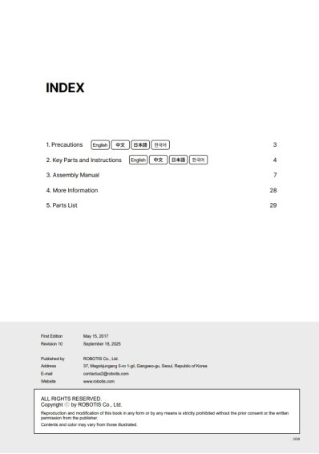
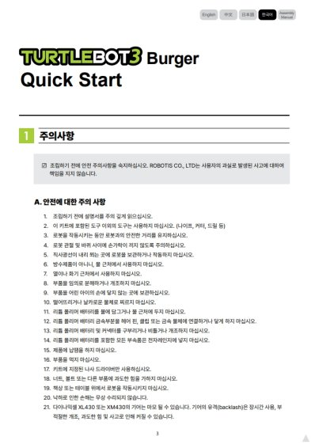
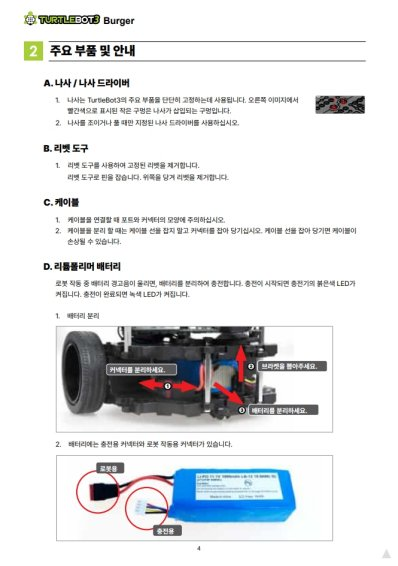
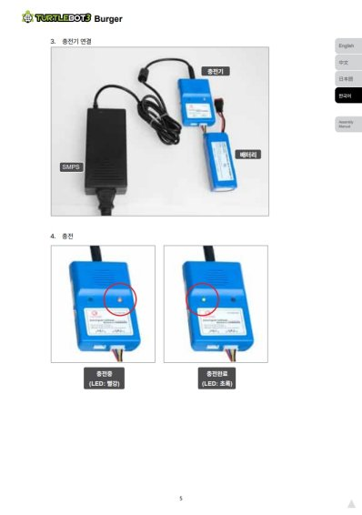
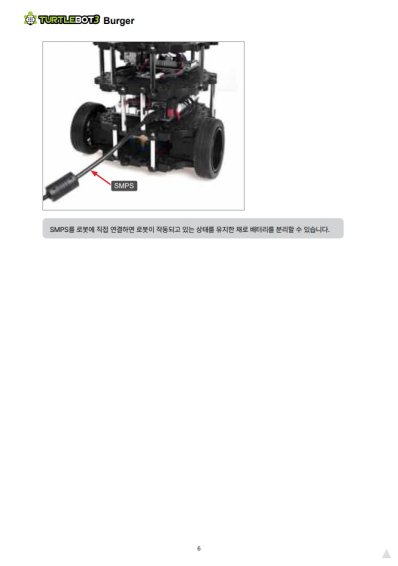
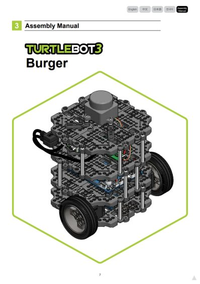
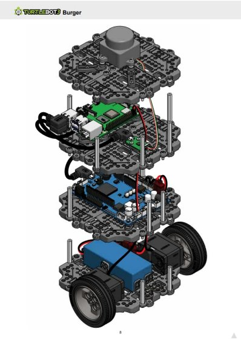

# turtlebot3_example

[turtlebot3_example](https://emanual.robotis.com/docs/kr/platform/turtlebot3/overview/)

https://youtu.be/rvm-m2ogrLA

https://youtu.be/1nTMyr4ybi0

https://youtu.be/5D9S_tcenL4

## 영문 메뉴얼
https://emanual.robotis.com/docs/en/platform/turtlebot3/overview/

 
 
 
 
 
 
 

