# turtlebot3_example

[turtlebot3_example](https://emanual.robotis.com/docs/kr/platform/turtlebot3/overview/)

 * TurtleBot3 15 Assembling the TurtleBot3 Basic : https://youtu.be/rvm-m2ogrLA
 * TurtleBot3 16 Assembling the TurtleBot3 Premium : https://youtu.be/1nTMyr4ybi0
 * TurtleBot3 31 Burger Assembly : https://youtu.be/5D9S_tcenL4

## 영문 메뉴얼
https://emanual.robotis.com/docs/en/platform/turtlebot3/overview/

   
   
   
 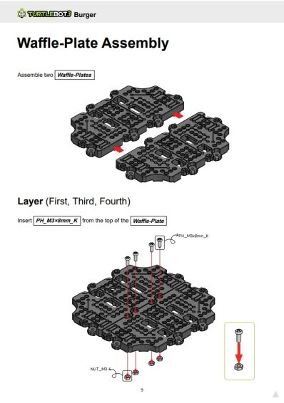  
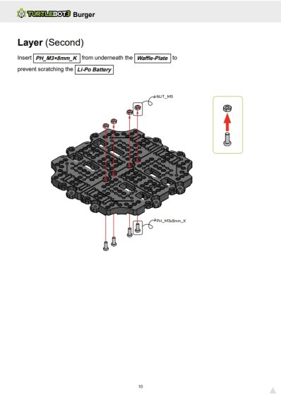 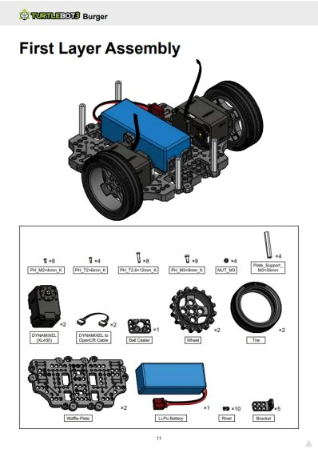  
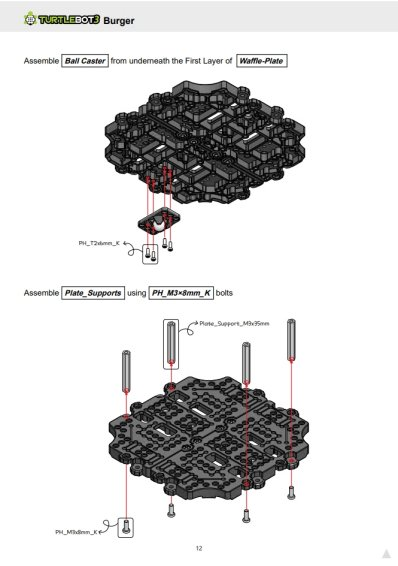 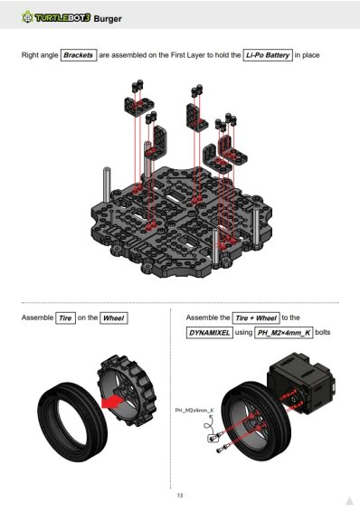  
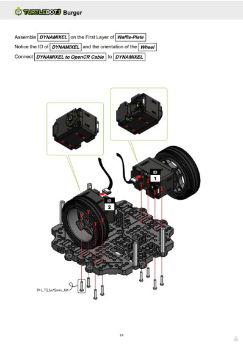 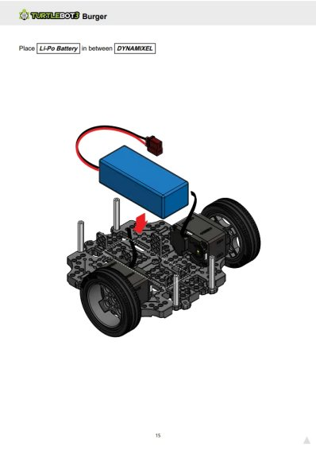  
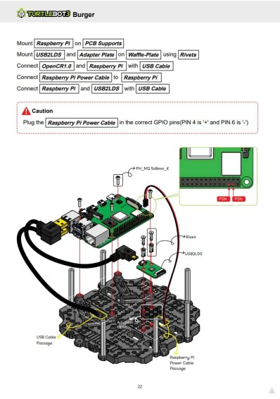 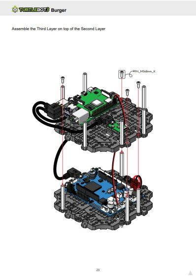  
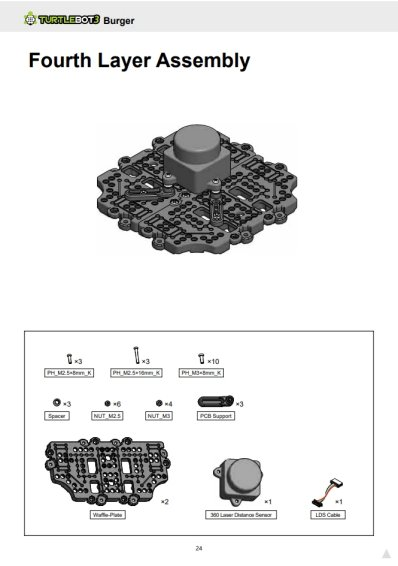 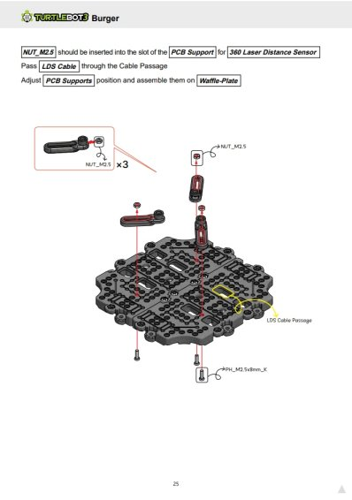  
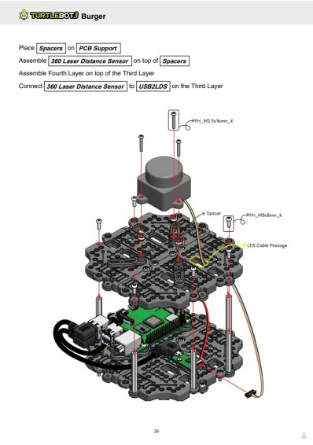 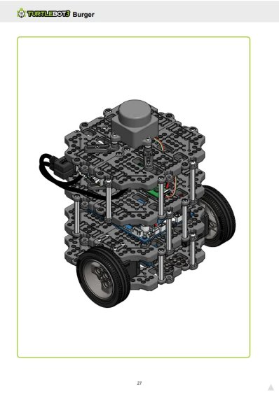  
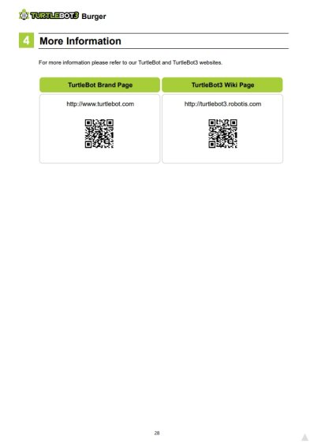 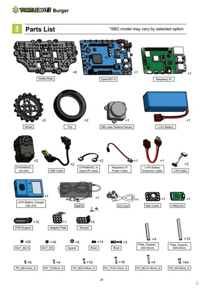  
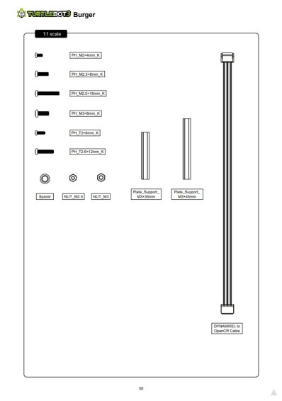 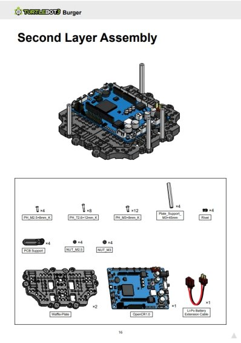  
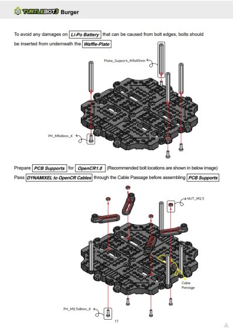 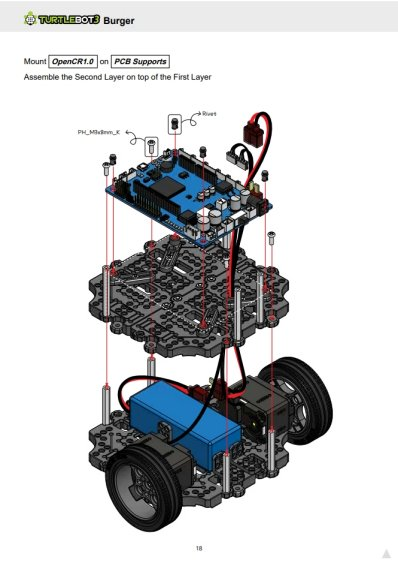  
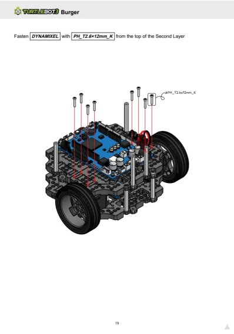 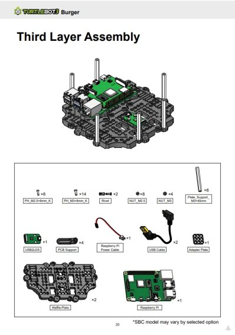  
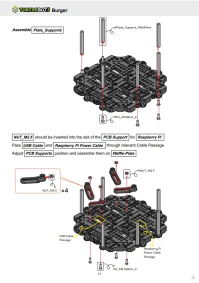  

📷 Image 01~02

📷 Image 03~04

## 도면

https://www.robotis.com/service/downloadpage.php?ca_id=7070

## TurtleBot3 Burger 3D 모델 다운로드 경로

* ① GitHub — STL 파일 (공식, 가장 확실)
   * ROBOTIS 공식 GitHub turtlebot3_description 패키지에 ROS용 메시 파일이 전부 포함되어 있습니다.
   * https://github.com/ROBOTIS-GIT/turtlebot3
   * 경로: turtlebot3_description/meshes/
      * bases/burger_base.stl
      * wheels/, sensors/ 등 개별 파트 STL 전부 포함
      * ROS 시뮬레이션(Gazebo, RViz)용으로도 바로 사용 가능

* ② Thingiverse — ROBOTIS 공식 업로드
   * ROBOTIS가 직접 업로드한 TurtleBot3 Burger 페이지가 있으며, 3D 프린팅 가능 파트와 비출력 파트가 구분되어 있습니다.
   * https://www.thingiverse.com/thing:3069610
   * 3D 프린팅 가능 파트: waffle_plate.stl, sprocket_wheel.stl, board_bracket.stl 등

* ③ GrabCAD — STEP 포함 어셈블리 모델
   * GrabCAD 라이브러리에 TurtleBot3 Burger 전체 어셈블리 모델이 등록되어 있으며, STEP, IGES 등 CAD 교환 포맷으로 다운로드 가능합니다. (무료 회원가입 필요)
   * https://grabcad.com/library/robotis-turltebot3-burger-1

* ④ 공식 Onshape 우회 방법
   * ROBOTIS 공식 문서에 따르면 전체 CAD 데이터는 Onshape 클라우드 CAD에서 제공되는데, Onshape에서 직접 STEP으로 내보내기가 막혀 있다면:

* Onshape → 파트 우클릭 → "Export" 시도
   * 안 되면 → "Copy to my documents" 로 본인 계정으로 복사 후 Export
   * 무료 계정은 Public 문서 복사가 가능한 경우 있음
